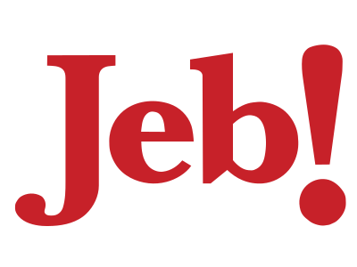
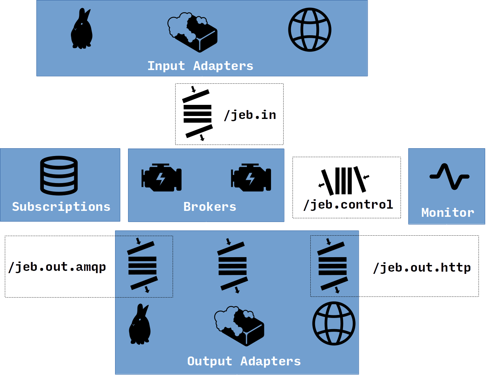

Jeb
===
**J**SON **E**vent **B**roker

Why
---
Every time some team decides that they want to provide a subscription API for
"events" from their system (e.g. "somebody entered the building," "a ticket was
updated," "this machine came online," "a database table was modified," "I am
now the leader instance," etc.), they come up with a different solution: some
message queue you have to set up, or some C++ API you have to use, or some
other thing.  Wouln't it be nice if you, the consumer, could specify how you
will receive events, perhaps even providing an output adapter yourself?

These publisher/subscriber systems always have their own "topic" language as
well, so that events can be efficiently filtered and brokered to the
appropriate subscribers.  Jeb takes a different approach.  At the risk of poor
scalability for large numbers of subscribers, subscription predicates in Jeb
are just Scheme programs computing functions of the event payload itself.  An
event is a JSON object, and a subscription is a Scheme function that takes the
JSON as its argument and produces a description of what to do, if anything.

What
----
Jeb is a suite of programs and POSIX message queues that together form a
generic JSON-based event ingress, filtering, and fan-out system.

See [the README in icons/](icons/README.md) for diagram credits.

TODO: Describe the diagram.

How
---
TODO: Usage (system setup, probably), build, etc.

More
----
TODO: The format of messages in each of the message queues, a description of
the subscruption predicate functions, how the `jeb-manager` works, etc.